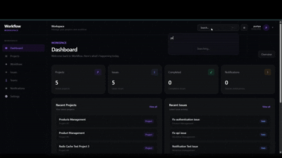

# 🚀 Workflow

<p align="center">
  
  
  
  
  
  
  
  
  
</p>

<p align="center">
  <strong>A production-oriented full-stack project, issue, and workflow management platform.</strong>
</p>

<p align="center">
  Plan projects, organize teams, manage issues, execute workflows,
  collaborate with team members, track activity, and manage notifications
  from a centralized workspace.
</p>

<p align="center">
  <a href="#-overview">Overview</a> •
  <a href="#-features">Features</a> •
  <a href="#-architecture">Architecture</a> •
  <a href="#-api">API</a> •
  <a href="#-setup">Setup</a> •
  <a href="#-deployment">Deployment</a>
</p>

---

## 🎬 Demo

<p align="center">
  
</p>

---

## 🌐 Deployment

| Resource | Status |
|---|---|
| Frontend | ✅ Deployed on Vercel |
| Backend API | ✅ Deployed on Render |
| PostgreSQL | ✅ Production database on Render |
| Redis | ✅ Configured on Render |
| Celery Worker | ⏭️ Not deployed (requires paid Render Background Worker) |
| Docker | ✅ Configured and working |
| Production Security | ✅ Configured |
| Static Files | ⚠️ DRF static assets not served; API functionality unaffected |

### Production URLs

- **Frontend:** https://workflow-amber-three.vercel.app
- **Backend API:** https://workflow-backend-2e74.onrender.com

# 📖 Overview

**Workflow** is a full-stack project and workflow management platform designed to provide a centralized workspace for teams to organize projects, track issues, manage structured workflows, collaborate through comments and attachments, and receive application notifications.

The application uses a modern separated frontend/backend architecture:

```text
React + Vite + Tailwind CSS
            │
            │ REST API
            ▼
Django + Django REST Framework
            │
      ┌─────┴─────┐
      ▼           ▼
 PostgreSQL     Redis
                  │
                  ▼
               Celery
```

The complete local environment is containerized with Docker Compose and consists of:

```text
Frontend + Nginx
        │
        ▼
Django + Gunicorn
   │           │
   ▼           ▼
PostgreSQL   Redis
                │
                ▼
             Celery
```

---

# ✨ Features

## 🔐 Authentication & Authorization

- JWT-based authentication
- Access and refresh tokens
- Refresh-token rotation
- Refresh-token blacklisting
- Protected API endpoints
- Role-Based Access Control (RBAC)
- Authenticated user profile

---

## 👥 Team Management

Teams provide a collaboration layer for users.

### Capabilities

- Create teams
- List teams
- View team details
- Add team members
- List team members
- Remove team members
- Track team ownership
- Prevent duplicate team memberships

```text
Team
├── Owner
└── Members
    ├── User
    ├── User
    └── User
```

---

## 📁 Project Management

Projects provide an organizational boundary for work.

### Capabilities

- Create projects
- List projects
- View project details
- Track project status
- Track project ownership
- Associate projects with teams
- Add project members
- List project members
- Remove project members
- Prevent duplicate project memberships

### Project statuses

```text
ACTIVE
COMPLETED
ARCHIVED
```

---

## 🐛 Issue Management

Issues represent actionable work items inside projects.

### Capabilities

- Create issues
- List project issues
- View individual issues
- Update issues
- Delete issues
- Assign issues
- Set issue priority
- Change issue status
- Set due dates
- Track issue creator
- Associate issues with projects

### Issue statuses

```text
TODO
IN_PROGRESS
DONE
BLOCKED
CANCELLED
```

### Issue priorities

```text
LOW
MEDIUM
HIGH
CRITICAL
```

---

## 🔄 Workflow Management

Workflows represent structured units of work that can be owned, assigned, prioritized, tracked, and collaboratively managed.

### Capabilities

- Create workflows
- List workflows
- View workflow details
- Track workflow status
- Track workflow priority
- Assign workflows
- Track workflow ownership
- Set due dates
- Add workflow members
- List workflow members
- Remove workflow members
- Track workflow activity
- Add comments
- Manage attachments

### Workflow statuses

```text
DRAFT
ACTIVE
COMPLETED
ARCHIVED
```

### Workflow priorities

```text
LOW
MEDIUM
HIGH
CRITICAL
```

---

## ⏰ Overdue Workflow Detection

Workflow contains domain-level overdue calculation.

A workflow is considered overdue when:

```text
Due Date Exists
      │
      ▼
Due Date < Current Time
      │
      ▼
Status != COMPLETED
      │
      ▼
Overdue = True
```

The logic is implemented through the workflow model's `is_overdue` property.

---

## 🧾 Workflow Activity

Workflow activity provides a timestamped history associated with workflows.

Each activity can contain:

- Workflow
- Actor
- Action
- Details
- Creation timestamp

```text
User
 │
 ▼
Action
 │
 ▼
Details
 │
 ▼
Timestamp
```

---

## 💬 Workflow Comments

Workflows support collaborative discussions through comments.

### Capabilities

- Create comments
- List comments
- View comment details
- Update comments
- Delete comments
- Track comment author
- Track creation time
- Track update time

---

## 📎 Workflow Attachments

Workflows support attachment metadata.

Each attachment can contain:

- File name
- File URL
- File size
- Content type
- Uploader
- Creation timestamp

---

## 🔔 Notifications

Workflow includes an application-level notification system.

### Notification types

```text
ISSUE_ASSIGNED
ISSUE_UPDATED
ISSUE_COMMENTED
PROJECT_ADDED
```

### Capabilities

- List notifications
- Track recipient
- Track notification type
- Display notification title
- Display notification message
- Track read/unread state
- Mark notifications as read
- Associate notifications with issues

---

# ⚡ Background Processing

Workflow uses **Celery** with **Redis** for asynchronous background processing.

Current registered tasks include:

```text
core.tasks.create_notification
core.tasks.workflow_background_test
```

### Task architecture

```text
Django
   │
   │ enqueue
   ▼
Redis
   │
   │ broker
   ▼
Celery Worker
   │
   ▼
Background Task
```

### Example task execution

```bash
docker compose exec backend python manage.py shell -c "from core.tasks import workflow_background_test; r=workflow_background_test.delay(); print(r.id)"
```

The task can be monitored through Celery logs:

```bash
docker compose logs celery --tail=50
```

---

# ❤️ Health & Infrastructure Monitoring

Dedicated health endpoints are available for application infrastructure.

```http
GET /api/health/
GET /api/health/redis/
GET /api/health/celery/
GET /api/health/celery/<task_id>/
```

These endpoints provide visibility into:

- Django/application health
- Redis connectivity
- Celery connectivity
- Celery task status

---

# 🏗️ Architecture

```text
                              ┌───────────────────┐
                              │      Browser      │
                              └─────────┬─────────┘
                                        │
                                        ▼
                              ┌───────────────────┐
                              │   React + Vite    │
                              │   Tailwind CSS    │
                              └─────────┬─────────┘
                                        │
                                  HTTP / REST
                                        │
                                        ▼
                              ┌───────────────────┐
                              │       Nginx       │
                              │   Reverse Proxy   │
                              └─────────┬─────────┘
                                        │
                                     /api/*
                                        │
                                        ▼
                              ┌───────────────────┐
                              │ Django REST API   │
                              │     Gunicorn      │
                              └───────┬─────┬─────┘
                                      │     │
                         ┌────────────┘     └────────────┐
                         ▼                               ▼
                  ┌──────────────┐                ┌──────────────┐
                  │ PostgreSQL   │                │    Redis     │
                  │   Database   │                │ Cache/Broker │
                  └──────────────┘                └──────┬───────┘
                                                         │
                                                         ▼
                                                  ┌──────────────┐
                                                  │    Celery    │
                                                  │    Worker    │
                                                  └──────────────┘
```

---

# 🧩 Domain Model

```text
                           ┌──────────────┐
                           │     User     │
                           └──────┬───────┘
                                  │
                ┌─────────────────┼──────────────────┐
                │                 │                  │
                ▼                 ▼                  ▼
           ┌─────────┐       ┌──────────┐     ┌──────────────┐
           │  Team   │       │ Project  │     │ Notification │
           └────┬────┘       └─────┬────┘     └──────────────┘
                │                  │
                │                  ▼
                │             ┌─────────┐
                │             │  Issue  │
                │             └─────────┘
                │
                ▼
           TeamMember


                           ┌──────────────┐
                           │   Workflow   │
                           └──────┬───────┘
                                  │
             ┌────────────────────┼────────────────────┐
             │                    │                    │
             ▼                    ▼                    ▼
      WorkflowMember      WorkflowActivity      WorkflowComment
                                                        │
                                                        ▼
                                              WorkflowAttachment
```

---

# 🗃️ Data Model

## Team

```text
Team
├── name
├── description
├── owner
├── created_at
└── updated_at
```

`TeamMember` connects users to teams and enforces unique `(team, user)` membership.

---

## Project

```text
Project
├── name
├── description
├── status
├── team
├── owner
├── created_at
└── updated_at
```

Project statuses:

```text
ACTIVE
COMPLETED
ARCHIVED
```

`ProjectMember` connects users to projects and enforces unique `(project, user)` membership.

---

## Issue

```text
Issue
├── project
├── title
├── description
├── status
├── priority
├── assignee
├── due_date
├── created_by
├── created_at
└── updated_at
```

Issue statuses:

```text
TODO
IN_PROGRESS
DONE
BLOCKED
CANCELLED
```

Issue priorities:

```text
LOW
MEDIUM
HIGH
CRITICAL
```

---

## Workflow

```text
Workflow
├── name
├── description
├── status
├── priority
├── due_date
├── owner
├── assigned_to
├── created_at
└── updated_at
```

Workflow statuses:

```text
DRAFT
ACTIVE
COMPLETED
ARCHIVED
```

Workflow priorities:

```text
LOW
MEDIUM
HIGH
CRITICAL
```

---

## WorkflowMember

```text
WorkflowMember
├── workflow
├── user
└── joined_at
```

A unique constraint prevents duplicate `(workflow, user)` memberships.

---

## WorkflowActivity

```text
WorkflowActivity
├── workflow
├── actor
├── action
├── details
└── created_at
```

---

## WorkflowComment

```text
WorkflowComment
├── workflow
├── author
├── content
├── created_at
└── updated_at
```

---

## WorkflowAttachment

```text
WorkflowAttachment
├── workflow
├── uploaded_by
├── file_name
├── file_url
├── file_size
├── content_type
└── created_at
```

---

## Notification

```text
Notification
├── recipient
├── notification_type
├── title
├── message
├── related_issue
├── is_read
└── created_at
```

---

# 🔐 Authentication Architecture

```text
┌───────────────┐
│     User      │
└───────┬───────┘
        │
        │ Credentials
        ▼
┌───────────────────────┐
│ JWT Authentication    │
└──────────┬────────────┘
           │
           ├──────────────► Access Token
           │
           └──────────────► Refresh Token
                                  │
                                  ▼
                         Refresh Rotation
                                  │
                                  ▼
                           Token Blacklist
```

Protected API requests use:

```http
Authorization: Bearer <access_token>
```

---

# 🛡️ Security

The application uses environment-based configuration for sensitive values.

Sensitive configuration includes:

- Django secret key
- Database credentials
- Redis configuration
- Production environment configuration

The `.env` file is excluded from Git.

```gitignore
.env
.env.*
```

Security-related configuration includes:

- `DEBUG=False` in the production configuration
- JWT authentication
- Refresh-token rotation
- Refresh-token blacklisting
- Protected API endpoints
- RBAC
- Django CSRF middleware
- Environment-based secrets
- Production deployment security configuration

HTTPS-specific protections such as HSTS and secure cookies are configured as part of production HTTPS hardening.

---

# 🧱 Technology Stack

## Frontend

| Technology | Purpose |
|---|---|
| React | User interface |
| Vite | Frontend tooling/build |
| Tailwind CSS | Styling |

## Backend

| Technology | Purpose |
|---|---|
| Python | Backend language |
| Django | Web framework |
| Django REST Framework | REST API |
| Gunicorn | WSGI application server |

## Data & Processing

| Technology | Purpose |
|---|---|
| PostgreSQL 16 | Primary database |
| Redis 7 | Cache and Celery broker |
| Celery | Asynchronous background tasks |

## Infrastructure

| Technology | Purpose |
|---|---|
| Docker | Containerization |
| Docker Compose | Service orchestration |
| Nginx | Frontend server and reverse proxy |

## Development

| Technology | Purpose |
|---|---|
| Git | Version control |
| GitHub | Repository hosting |
| Postman | API testing |

---

# 🌐 API

Base API prefix:

```text
/api/
```

---

## Authentication

The project uses JWT authentication endpoints provided by the authentication layer.

```http
POST /api/auth/token/
POST /api/auth/token/refresh/
GET  /api/auth/profile/
```

---

## Health

```http
GET /api/health/
GET /api/health/redis/
GET /api/health/celery/
GET /api/health/celery/<task_id>/
```

---

## Teams

```http
GET    /api/teams/
POST   /api/teams/create/
GET    /api/teams/<id>/

GET    /api/teams/<id>/members/
POST   /api/teams/<id>/members/
DELETE /api/teams/<team_id>/members/<id>/
```

---

## Projects

```http
GET    /api/projects/
POST   /api/projects/create/
GET    /api/projects/<id>/

GET    /api/projects/<id>/members/
POST   /api/projects/<id>/members/
DELETE /api/projects/<project_id>/members/<id>/
```

---

## Issues

```http
GET    /api/projects/<project_id>/issues/
POST   /api/projects/<project_id>/issues/

GET    /api/projects/<project_id>/issues/<id>/
```

---

## Workflows

```http
GET    /api/workflows/
POST   /api/workflows/create/
GET    /api/workflows/<id>/
```

### Workflow members

```http
GET    /api/workflows/<id>/members/
POST   /api/workflows/<id>/members/
DELETE /api/workflows/<workflow_id>/members/<id>/
```

### Workflow activity

```http
GET /api/workflows/<id>/activities/
```

### Workflow comments

```http
GET    /api/workflows/<id>/comments/
POST   /api/workflows/<id>/comments/

GET    /api/workflows/<workflow_id>/comments/<id>/
```

### Workflow attachments

```http
GET    /api/workflows/<id>/attachments/
POST   /api/workflows/<id>/attachments/

GET    /api/workflows/<workflow_id>/attachments/<id>/
```

---

## Notifications

```http
GET  /api/notifications/
POST /api/notifications/<id>/read/
```

---

# ⚙️ Backend Architecture

The backend separates application responsibilities across Django components.

```text
Django
│
├── Models
│   └── Domain & database relationships
│
├── Serializers
│   └── API data validation / representation
│
├── Views
│   └── HTTP request handling
│
├── URLs
│   └── API routing
│
├── Tasks
│   └── Celery background processing
│
├── Middleware
│   └── Request logging
│
└── Exceptions
    └── Centralized API exception handling
```

---

# 📝 Request Logging

The application includes request logging middleware.

Logged request information includes:

- HTTP method
- Endpoint
- Response status
- Request duration
- Timestamp
- Log level

Example:

```text
POST /api/projects/create/ -> 201 (0.064s)
GET /api/projects/ -> 200 (0.008s)
```

---

# 🐳 Docker Architecture

Workflow is containerized using Docker Compose.

```text
┌───────────────────────────────────────────────────┐
│                 Docker Compose                    │
│                                                   │
│  ┌──────────────┐       ┌─────────────────────┐   │
│  │   frontend   │──────►│      backend        │   │
│  │ React/Nginx  │       │ Django/Gunicorn     │   │
│  └──────────────┘       └──────────┬──────────┘   │
│                                    │              │
│                     ┌──────────────┼──────────┐   │
│                     ▼              ▼          ▼   │
│                PostgreSQL       Redis      Celery │
│                                                   │
└───────────────────────────────────────────────────┘
```

### Docker services

| Service | Responsibility |
|---|---|
| `frontend` | React production build + Nginx |
| `backend` | Django REST API + Gunicorn |
| `db` | PostgreSQL 16 |
| `redis` | Redis 7 |
| `celery` | Celery worker |

---

# 🌐 Nginx Reverse Proxy

Nginx serves the compiled React application and forwards API requests to Django.

```text
Browser
   │
   ├── /
   │    └── React application
   │
   └── /api/*
        │
        ▼
      Nginx
        │
        ▼
  backend:8000
```

The frontend container uses:

```text
root /usr/share/nginx/html
```

and routes:

```text
/api/ → backend:8000
```

Client-side routes fall back to:

```text
/index.html
```

---

# ⚡ Celery + Redis Architecture

```text
Django Backend
      │
      │ Task
      ▼
Redis Broker
      │
      ▼
Celery Worker
      │
      ▼
Task Execution
      │
      ▼
Redis Result Backend
```

Redis endpoints used by the Docker environment:

```text
Cache:
redis://redis:6379/1

Celery Broker:
redis://redis:6379/0

Celery Result Backend:
redis://redis:6379/0
```

---

# 🗄️ PostgreSQL Persistence

PostgreSQL runs using the official PostgreSQL 16 Alpine image.

Docker Compose uses a named volume:

```yaml
postgres_data:
```

mounted at:

```text
/var/lib/postgresql/data
```

The database service includes a PostgreSQL health check using:

```text
pg_isready
```

Backend and Celery services depend on PostgreSQL becoming healthy before starting.

---

# 🔴 Redis Persistence

Redis runs using Redis 7 Alpine.

Docker Compose uses:

```yaml
redis_data:
```

mounted at:

```text
/data
```

Redis health is checked with:

```bash
redis-cli ping
```

---

# 📦 Project Structure

```text
Workflow/
│
├── accounts/
│
├── core/
    ├── management
    ├── migrations
    ├── tests
│   ├── models.py
│   ├── views.py
│   ├── serializers.py
│   ├── urls.py
│   ├── tasks.py
│   ├── middleware.py
│   ├── exceptions.py
│   └── ...
│
├── config/
│   ├── settings.py
│   ├── urls.py
│   ├── celery.py
│   ├── wsgi.py
│   └── ...
│
├── frontend/
│   ├── src/
│   ├── public/
│   ├── Dockerfile
│   ├── nginx.conf
│   ├── package.json
│   └── ...
│
├── Dockerfile
├── docker-compose.yml
├── .dockerignore
├── .gitignore
├── manage.py
├── requirements.txt
└── README.md
```

---

# 🚀 Setup

## Prerequisites

### Local development

- Python 3.11+
- Node.js
- npm
- Git

### Docker environment

- Docker Desktop
- Docker Compose

---

# 🐍 Backend Setup

Create a virtual environment:

```bash
python -m venv venv
```

Activate it on Windows:

```bash
venv\Scripts\activate
```

Install dependencies:

```bash
pip install -r requirements.txt
```

Apply migrations:

```bash
python manage.py migrate
```

Create an administrator:

```bash
python manage.py createsuperuser
```

Run the development server:

```bash
python manage.py runserver
```

---

# ⚛️ Frontend Setup

```bash
cd frontend
npm install
npm run dev
```

Build the frontend:

```bash
npm run build
```

---

# 🐋 Docker Setup

Create a `.env` file containing the required environment variables.

Build and start all services:

```bash
docker compose up -d --build
```

Check running services:

```bash
docker compose ps
```

Open:

```text
http://localhost
```

Apply migrations:

```bash
docker compose exec backend python manage.py migrate
```

Create a superuser:

```bash
docker compose exec backend python manage.py createsuperuser
```

---

# 🔧 Environment Configuration

Example:

```env
DJANGO_DEBUG=False
DJANGO_SECRET_KEY=<your-secret-key>

POSTGRES_DB=workflow_db
POSTGRES_USER=<your-postgres-user>
POSTGRES_PASSWORD=<your-postgres-password>
POSTGRES_HOST=db
POSTGRES_PORT=5432

REDIS_CACHE_URL=redis://redis:6379/1
CELERY_BROKER_URL=redis://redis:6379/0
CELERY_RESULT_BACKEND=redis://redis:6379/0
```

Do not commit secrets or `.env` files.

---

# 🔍 Useful Docker Commands

### Start

```bash
docker compose up -d
```

### Build

```bash
docker compose build
```

### Build and start

```bash
docker compose up -d --build
```

### Stop

```bash
docker compose down
```

### Check services

```bash
docker compose ps
```

### Backend logs

```bash
docker compose logs backend --tail=50
```

### Frontend logs

```bash
docker compose logs frontend --tail=50
```

### Celery logs

```bash
docker compose logs celery --tail=50
```

### Django shell

```bash
docker compose exec backend python manage.py shell
```

### PostgreSQL shell

```bash
docker compose exec db psql -U <POSTGRES_USER> -d <POSTGRES_DB>
```

---

# 🧪 Verification

The Dockerized application was verified across its major services and application flows.

| Component / Flow | Status |
|---|---|
| React frontend | ✅ |
| Nginx | ✅ |
| Django API | ✅ |
| Gunicorn | ✅ |
| PostgreSQL | ✅ |
| Redis | ✅ |
| Celery worker | ✅ |
| JWT authentication | ✅ |
| JWT refresh | ✅ |
| Protected API requests | ✅ |
| Project creation | ✅ |
| Issue retrieval | ✅ |
| Notifications | ✅ |
| Background task execution | ✅ |
| Docker Compose | ✅ |
| Database persistence | ✅ |
| Database restoration | ✅ |

Example successful Celery execution:

```text
Task core.tasks.workflow_background_test
succeeded
```

---

# 💾 Database Backup & Restore

The project includes a PostgreSQL backup file used during database restoration and verification.

Backup artifacts are excluded from the regular backup directory through `.gitignore` rules such as:

```gitignore
backups/*.sql*
backups/*.dump
```

The Dockerized PostgreSQL environment was successfully restored and application data was verified afterward.

---

# 🩺 Django Deployment Checks

Production-oriented Django configuration can be checked with:

```bash
docker compose exec backend python manage.py check --deploy
```

This verifies Django's deployment security configuration and reports settings that require production-specific hardening.

---

# ☁️ Deployment Architecture

The planned production architecture separates the frontend from the backend.

```text
                         GitHub
                           │
                  ┌────────┴────────┐
                  ▼                 ▼
               Vercel             Render
                  │                 │
                  ▼                 ▼
             React App        Django REST API
                                    │
                           ┌────────┴────────┐
                           ▼                 ▼
                      PostgreSQL          Redis
                                             │
                                             ▼
                                          Celery
```

### Frontend

**Vercel**

Responsible for hosting the production React/Vite application.

### Backend

**Render**

Responsible for hosting the Django/Gunicorn application and supporting backend services.

### Database

PostgreSQL.

### Background processing

Celery worker connected through Redis.

---

# 🔄 Deployment Flow

```text
Developer
    │
    ▼
Git
    │
    ▼
GitHub
    │
    ├──────────────────┐
    ▼                  ▼
 Vercel              Render
    │                  │
    ▼                  ▼
Frontend             Backend
                       │
                 ┌─────┴─────┐
                 ▼           ▼
            PostgreSQL     Redis
                              │
                              ▼
                           Celery
```

---

# 📈 Scalability Direction

The architecture separates the major application responsibilities so they can be scaled independently as usage grows.

```text
                ┌───────────────┐
                │ Load Balancer │
                └───────┬───────┘
                        │
              ┌─────────┴─────────┐
              ▼                   ▼
        Django Instance     Django Instance
              │                   │
              └─────────┬─────────┘
                        ▼
                   PostgreSQL
                        │
                      Redis
                        │
              ┌─────────┴─────────┐
              ▼                   ▼
        Celery Worker        Celery Worker
```

Potential future infrastructure improvements include:

- Multiple backend instances
- Multiple Celery workers
- Managed PostgreSQL
- Managed Redis
- Load balancing
- CDN-backed frontend delivery
- Centralized monitoring
- Distributed error tracking

---

# 🧠 Engineering Highlights

Workflow demonstrates practical full-stack and backend engineering across several layers:

- REST API architecture
- JWT authentication
- Role-Based Access Control
- Relational database modeling
- PostgreSQL
- Redis
- Celery
- Asynchronous task processing
- Custom middleware
- Centralized exception handling
- Structured request logging
- Health-check endpoints
- Docker containerization
- Docker Compose orchestration
- Nginx reverse proxy
- Gunicorn production serving
- Persistent Docker volumes
- Database backup and restoration
- Environment-based configuration
- Frontend/backend separation
- Cloud deployment architecture

---

# 🧪 Development Workflow

```text
Feature
  │
  ▼
Data Model
  │
  ▼
Django API
  │
  ▼
Frontend Integration
  │
  ▼
Testing
  │
  ▼
Docker Verification
  │
  ▼
Git Commit
  │
  ▼
Deployment
```

---

# 🤝 Contributing

Contributions and technical improvements are welcome.

```bash
git checkout -b feature/your-feature
```

Make your changes, run the relevant checks, then:

```bash
git add .
git commit -m "Add your feature"
git push origin feature/your-feature
```

---

# 🧹 Repository Hygiene

The repository excludes local, generated, and sensitive files including:

```text
.env
.env.*
venv/
.venv/
__pycache__/
frontend/node_modules/
frontend/dist/
.vscode/
.idea/
backups/*.sql*
backups/*.dump
```

---

## 🛣️ Project Status

### ✅ Completed

- Frontend deployed on Vercel
- Backend deployed on Render
- Production PostgreSQL configured
- Redis configured
- Production CORS and security settings configured
- Dockerized backend
- JWT authentication
- Role-based access control
- Projects and teams management
- Issues and notifications
- Celery task architecture implemented locally
- Automated database migrations during deployment

### 🔄 Future Enhancements

- GitHub Actions CI/CD pipeline
- Production Celery worker
- Advanced monitoring and error tracking
- Expanded automated test coverage
- API documentation
- Real-time updates
- Performance optimization

---

# 📊 Project Snapshot

```text
┌─────────────────────────────────────────────────────┐
│                      WORKFLOW                       │
├─────────────────────────────────────────────────────┤
│                                                     │
│  Frontend        React + Vite + Tailwind CSS       │
│                                                     │
│  Backend         Django + Django REST Framework     │
│                                                     │
│  Database        PostgreSQL 16                      │
│                                                     │
│  Cache           Redis 7                            │
│                                                     │
│  Workers         Celery                             │
│                                                     │
│  Web Server      Nginx                              │
│                                                     │
│  App Server      Gunicorn                           │
│                                                     │
│  Infrastructure  Docker + Docker Compose            │
│                                                     │
│  Deployment      Vercel + Render                    │
│                                                     │
└─────────────────────────────────────────────────────┘
```

---

# 🎯 Why Workflow

Workflow was built as more than a basic CRUD application.

The project brings together:

```text
Modern Frontend
       +
RESTful Backend
       +
JWT Authentication
       +
RBAC
       +
Relational Database
       +
Caching
       +
Asynchronous Processing
       +
Notifications
       +
Containerization
       +
Production-Oriented Infrastructure
```

It demonstrates the complete lifecycle of a modern web application:

```text
Design
  ↓
Development
  ↓
API Integration
  ↓
Database Integration
  ↓
Background Processing
  ↓
Containerization
  ↓
Testing & Verification
  ↓
Cloud Deployment
```

---

# 👨‍💻 Author

## Pushpa Kumari

**B.Tech — Artificial Intelligence & Data Science**

Full-Stack / Backend Developer

<p align="left">
  <a href="https://github.com/Pushpa2-ai">
    
  </a>
  <a href="https://www.linkedin.com/in/pushpa-kumari-803226259">
    
  </a>
</p>

---

# 📄 License

This project is currently maintained as a software engineering portfolio project.

---

<p align="center">

## Workflow

### Plan • Collaborate • Track • Execute

Built with React, Django, PostgreSQL, Redis, Celery, and Docker.

</p>